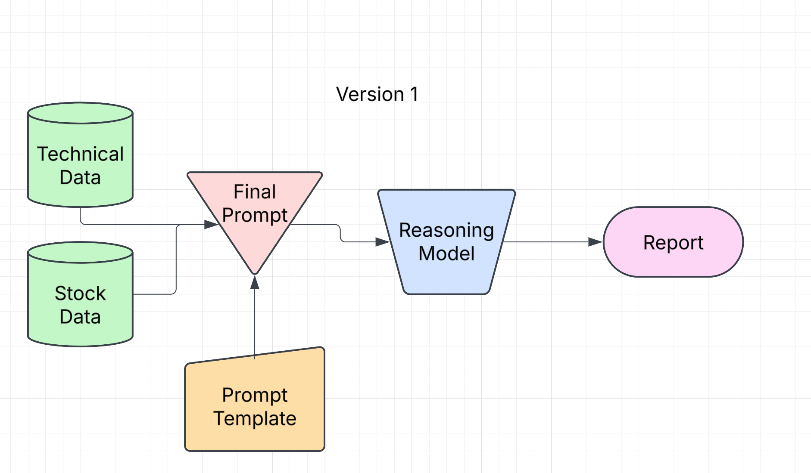

# OpenAGIFund
Thesis:
This repository is currently my own realization of the future of finance. Starting from the ground up, rather than taking the approach of much worse projects which just throw together a bunch of high level agents, this project aims to start from the bottom and build up to an entire team (hive) of agent minds.
Specifically I drew inspiration from this project after having back in september tested a mini version of this with my own money and getting a 110% return within a month doing pure naked option contracts (no I did not only do call options). The mini version was significantly less thought through as it would essentially extract a bunch of data, and then feed it into a single llm inference (anthropic in that case). The original version missed many crucial aspects of a more sophisticated engine yet brought great results. 
Following that time of me implementing this first version of the system on my own time, I found people implementing stuff like this a few months later and posting about it on twitter (and even trending from it), however similar to my system they were missing a lot of key components and implementing a lot of things poorly (such as manual implementation of only a few technical indicators and having weird/inconsistent sampling frequency decisions). I decided that it would be best for me to do omy own implementation of the project but in a more sophisticated (at least from my viewpoint) manner. 

Now to get more specific about the vision I have for this project - 
stage 1 is creating the best tool that quants have ever used in terms of knowledge extraction, something that automates the process of manual guess and check for the massive variety of technical indicators out there, and something that will enable easy and adaptable check if a new indicator comes out. It is common knowledge that technical indicators do not always say the full story, due to this I believe stage 1 should also contain support for external market events that could add noise to the relationship that the language model is attempting to extract between stock data and technical data. Now this would not feel complete without considering real research as well, another aim of stage 1 is that we are able to integrate new and improving research on things like postively/negatively correlated markets (like how Ethereum was found to have a positive correlation with Gold (in older research I have found)). The combination of relationship understanding, the lag associated with such relationships, the chaining of such relationships (for example something like a lag visible between a highly negatively correlated housing market and stock market and the implications to upcoming volatility of the stock market mixed with the fact that in previous investigations the combination of bbands technical indicator along with volatility shells out a very likely next scenario that will bring massive profits) and even more will and should be completely automated by the power of language models, as they are tools that are inevitable and therefore should be embraced. An exciting aspect of stage 1 is that after it is complete, looking into allowing the language model to perform its own sort of "research" on a stocks data rather than relying on any technical indicator currently available could be deeply exciting. 
stage 1.5 - the use of stage 1 to gather insights for people with access to high speed trading machines who can now further focus in on the absolute most valuable indicative variables (with the assumption that the language model that this information gets feeded to continues on this steep trajectory of improvement) and combine them with external market models (like polymarket) which can help them decide whether to short or long an event or potentially avoid an event all together and only trade when there is peace in the economy (who knows what the agent will say !). 
stage 2 is a bit more complicated as I do not necessarily believe we should take the kind of blind eyed approach of those popular online twitter ai hedge funds which make large diagrams and name some of the boxes "Risk Portfolio Manager" as if that helps (for now I believe the best possible inference can be extracted from a competent entity (for now a human) handling single inference passes and combining the summary reports offered by the repo here for something greater and deeper), I think stage 2 will be complete when we have Multimodal Autonomous Agents (such as OpenAI's Operator or Anthropics Computer Use) running models like mine to understand the most recent specific relationships and combining insights of other agents (or real time news, whence why I said computer use agents that can essentially always be "watching" the news whether its on twitter or some other source) that may be researching a distinct but potentially correlated / significant path. 
stage 3 we have a bunch of perfect autonomous hedge funds and money doesnt matter anymore. 
Jokes aside, I am sure I am not the only one who thinks that whichever firm leverages AGI first will win for the rest of time, I think it is more than the right time to start positioning now. This is simply a tool I think can contribute to that and I wanted to make it open source because I do not want to be seen as a pussy who gets out built. 
Again being serious, I would drop out of school to pursue this project with enough funding or even within a larger more experienced team that was rich and could afford it. This stuff seems significantly more important than me learning about loss of significance in numerical computation course.

A warning : A lot of the research found in the past few years regarding language models seem to expire very quickly, due to this I am sticking to a single inference pass wherever there needs a specific inference done (of course the chaining of inference passes is possible using the "supercharge" argument in model_interface.py if you want to do something like extract a summary of all summaries (more details later)), specifically I do not want to consider research regarding things like Self Discover or Multi Agent Debate which seem to significantly boost the performance of non reasoning models, this is because as these models are getting significantly smarter the typical drawbacks of the models which were improved upon using such methods kind of just dont make sense, for example Self Discover manually inserts reasoning traces into the prompting process then "Adapts it" to the task at hand. Similarly for Multi Agent Debate paper we are forcing two or more models to disagree with one another which does not necessarily make sense if the precision and accuracy of such models does indeed keep improving on this steep path. Now that is not to say that we do not listen to any empirical evidence, specifically if you look at the "prompts" directory you will see that for reasoning models we follow the approach of prompting recommended by both twitter and the OpenAI team which state that structure and sequence of prompt is important (specifically its Goal -> Structure -> Warning -> Context Dump), I plan to keep looking at the new empirical evidence found for best prompting techniques and regularly update the current schema used. That warning being said, go ahead and do whatever you want with this code as it is open source !

Currently in Stage 1:
Goals and Milestones:
- Perfect support for version 1 of this project with Gemini 2.0 flash thinking (recommended due to zero api cost, high token limit (thus higher frequency sampling) and raw intelligence).
- Currently engineering support for o1-mini, o3-mini (the main problem is the token limit as these are a fifth of googles), and Claude 3.5 Sonnet (really I am waiting for their next model to be released).
- Currently engineering support for consideration external market events, as integrating this into the prompt is a research problem on its own.
- Currently engineering support for relationship chaining - i.e. determining how we are going to check to fuse relationship between more than one indicator and stock data and how to deal with the varying token limits of models in such.
- Currently strategizing how support for crypto and sports betting analysis would look under a similar framework. Worth exploring in my opinion however this is going to be not a main priority for the time being as I need to have a clear focus to get anything done.
- 
**IMPORTANT STRUCTURE OF CODE**

  **Currently This Codebase Supports Windows Setup, Figure out for yourself how to install everything needed if performing on another OS or even directly copy the structure to your own using Cursor to speed up the process if dependencies become a critical issue.**
- Think about the structure in this way, running "stock_technicals_current.py" in its current form will produce a directory named after the ticker you insert in the console that you want to analyze and as many months back as you request (which you will also insert into the console), in the files within that directory you will find all technical indicators offered by Alpha Vantage sampled every 5 minutes including extended hours. It is this way for both the stock price data and the technical indicator data (in order to have mirroring sampling methods so that way the language model (currently only supporting Gemini 2.0 flash thinking) fully analyzes the relationship between a stocks data and a SINGLE (at the time of writing) technical indicator to see if there is any relationship present). To perform the said analysis (after you see the data is done being fetched) you will run "model_interface.py" which will require you to use the following console call:
- "python model_interface.py --provider gemini --model gemini-2.0-flash-thinking-exp-01-21 --ticker NVDA --indicator bbands --include_market_events False" , again notice we specify which technical indicator as we are only performing the correlation analysis one at a time for now. If you want to not do month by month and want a report for all the months you previously extracted the data for, you simply have to add a "--supercharge" argument which would then look like     "python model_interface.py --provider gemini --model gemini-2.0-flash-thinking-exp-01-21 --ticker NVDA --indicator bbands --include_market_events False --supercharge" in which case it will perform reports for each month individually then fuse them at the end for a final intelligent summarization. Play around with the prompt and output token length as you please.
- you will need to get your own "OPENAI_API_KEY", "ALPHA_VANTAGE_KEY", "GOOGLE_API_KEY" of course from OpenAI, Alpha Vantage (requires a paid tier for just two of the like 30 indicators), Google AI Studio API key (soon expect an anthropic api key to be needed too as well as a key for a more proper external market event simulator (polymarket maybe ?!)).
- Lastly, I have left examples of the kind of output structure you can expect from running the previously mentioned files, for the data extraction that comes from running "stock_technicals_current.py" you will find an example structure in NVDA_HISTORICAL. Similarly in model_outputs/NVDA_outputs you will see an example report that the LLM generated for the month of october in 2024. Hopefully this further clears up the idea of whats happening here.
To conclude: The aim of this is to start laying down the foundation for what a comprehensive, and intelligent approach to an autonomous hedge fund would look like. By beginning with leveraging language model analysis on stock data and technical data and then expanded to new horizons, it should in theory be a proper construction of what we need to get to the next stages. It is also most compatible with rapid utility of such services, as if we started from the top down like many other "AI Hedge Fund" projects, we would not really find the process as compatible or really even useful as quickly. 
